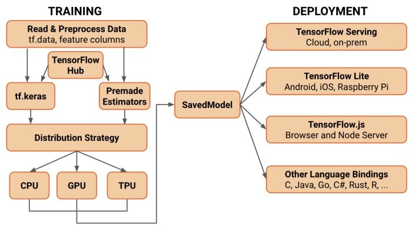

# Tensorflow 1 vs Tensorflow 2

Op aanvraag van de klant hebben we hier een klein rapport uitgeschreven voor het verschil tussen tensorflow 1 en tensorflow 2. Het is aangeraden om heel vroeg de beslissing te maken of je met TF 1 of TF 2 gaat werken. 

## Tensorflow 1
Het voordeel van TF 1 was dat het heel veelzijdig was waardoor het dus erg geliefd was onder de gebruikers. Het heeft echt een groot nadeel: het is erg moeilijk te leren en te gebruiken. Omwille van deze reden zijn er dus veel high level packages gemaakt die het werken met TF 1 vergemakkelijken, enkele voorbeelden hiervan zijn "Keras" en "Pytorch". In TF 1 moeten we voor het bouwen van een model eerst placeholders declareren. Dit waren de dummy-variabelen die later (in de sessie) zullen worden gebruikt om gegevens aan het model te voeden. Er waren veel ingebouwde API's voor het bouwen van de lagen zoals tf.contrib, tf.layers en tf.keras.

## Tensorflow 2
TF 2 heeft het beste van twee werelden: de veelzijdigheid van TF 1 en de eenvoud van Keras op hoog niveau. Nu kunt u uw model bouwen door uw eigen wiskundige bewerkingen te definiëren, zoals voorheen kunt u de wiskundige module (tf.math) en de lineaire algebra (tf.linalg) module gebruiken. U kunt echter profiteren van de Keras API en tf.layers-module op hoog niveau. Het belangrijkste is dat we geen tijdelijke aanduidingen meer hoeven te definiëren.

## Problemen
De problemen die wij tegenkwamen was dat als we wilden trainen in TF1 dat we zoals we eerder zeiden dat je tijdelijk placeholders nodig hebt. Deze zijn heel lastig om te definiëren omdat je pas weet of ze correct waren wanneer je jouw model in gebruik neemt (waarschijnlijk wat er bij ons is misgelopen). Het trainen in TF2 was een heel stuk simpler, zeker met de guide die we gegeven hebben in ProblemenMetBijTrainenVanAI, helaas was het project waarop wij hebben verder gebouwd, gecreëerd met TF1. Wat zorgde voor heel wat moeilijkheden. Indien we wat meer tijd hadden gehad was het best mogelijk geweest om ons model beter te trainen in TF1, ons bijgetraind model in TF2 omzetten naar TF1 of ons project refactoren naar TF2.

## Conclusie
Het is erg belangrijk om bewust te zijn van je versie van TF want deze kan later grote gevolgen hebben en je voor heel wat dilemma's zetten. Nu raden wij aan om met TF2 te werken indien mogelijk gewoon omdat TF2 het veel makkelijker maakt voor u. Indien dit niet mogelijk is wees er van bewust dat u voor veel lange uren gaat staren naar vreemde error messages.
