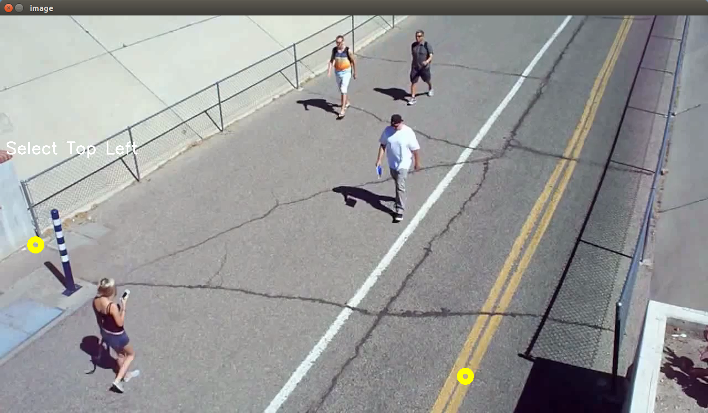
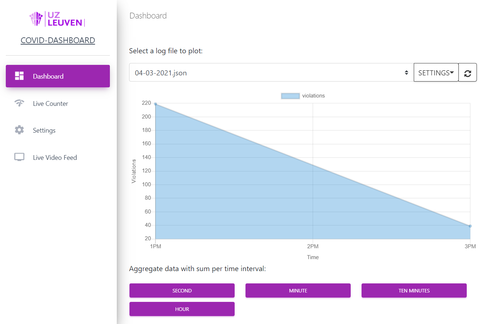
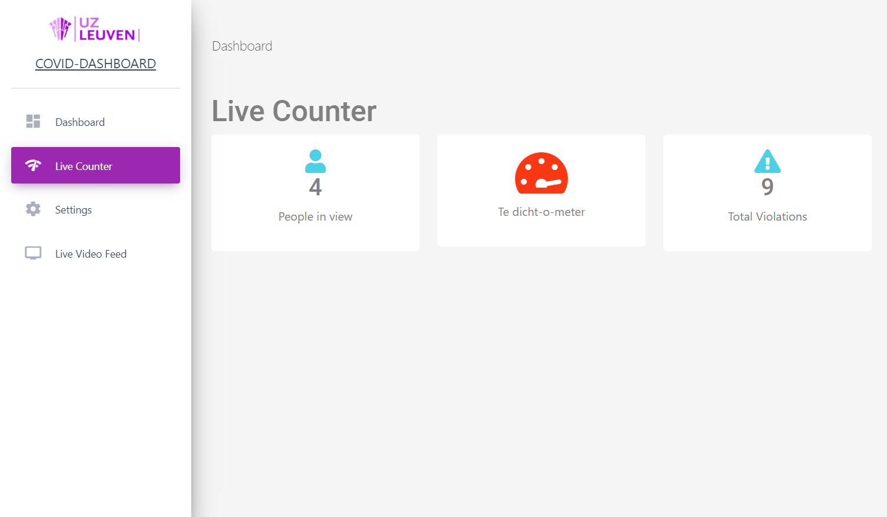
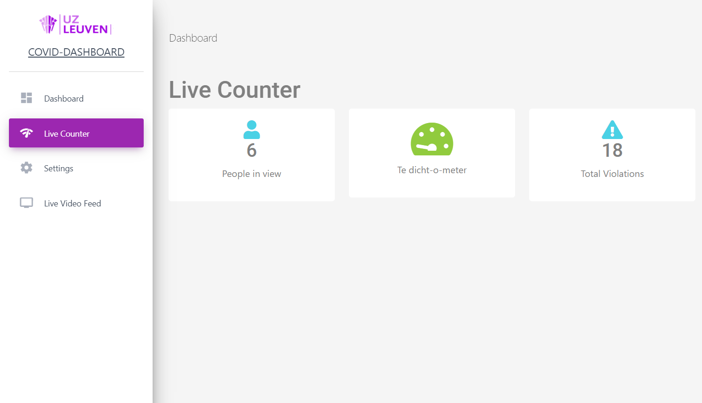
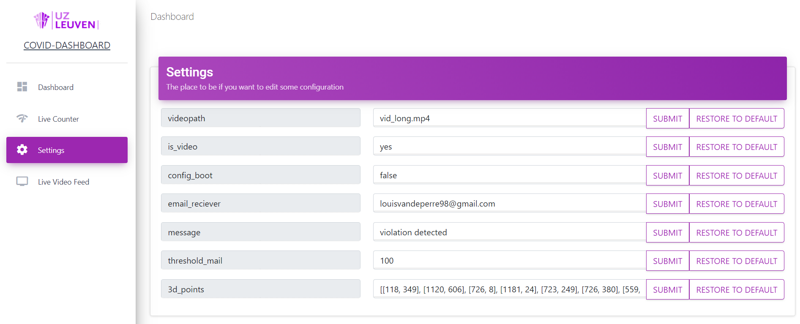
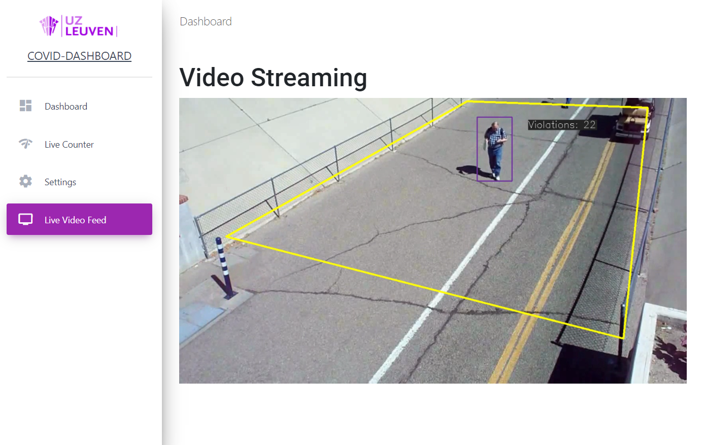

# Handleiding

## Introductie

Welkom welkom. In onderstaande geschriften vindt u de gebruiksaanwijzing betreffende de detect-o-meter.


## Eerste keer opstarten

**De initiele configuratie van de software gaat als volgt:**

Vooraleer de software te gebruiken is het aangewezen om al een aantal sofwarepakketten ter beschikking te brengen. Eerst en vooral kunt u de Github repository binnenhalen:

```bash
git clone https://github.com/martijnmeeldijk/afstudeerproject.git
cd afstudeerproject/SocialDistancingAI
```

Installeer [Python](https://www.python.org/downloads/) en maak een nieuwe [virtual environment](https://towardsdatascience.com/setting-up-python-platform-for-machine-learning-projects-cfd85682c54b)

Vervolgens kunt u de nodige dependencies installeren met:

```shell
pip install -r xrequirements.txt
```

of met een specifieke versie van python (3.6 is aangeraden):

```bash
python3.x -m pip install -r xrequirements.txt
```

bij **problemen met tensorflow** kan [deze guide](https://docs.nvidia.com/deeplearning/frameworks/install-tf-jetson-platform/index.html) helpen.	

Installeer **Flask** (nodig voor de webserver waarop het project draait)

```bash
sudo pip install Flask
```


Start de applicatie met dit commando (de host flag zorgt ervoor dat hij luistert naar alle binnenkomende verbindingen)

```bash
sudo flask run --HOST=0.0.0.0
```


Als u de applicatie voor de eerste keer opstart, verschijnt er een venster waarop u **vier punten** moet aanduiden. Deze punten worden gebruikt om het beeld te schalen, zodat afstanden correct berekend kunnen worden. Deze punten moeten in de echte wereld een rechthoekig vlak voorstellen. De instructies op het scherm duiden aan welk punt er moet aangeduid worden (top left, bottom right, etc). Vervolgens vraagt het programma om **twee punten** aan te duiden die **1.5m uit elkaar** liggen. Klik ten slotte nog een laatste keer en het venster sluit zich vanzelf. Nu start de webserver en kan je de visuele interface raadplegen op `localhost:5000` of op het ip adres dat u aan het apparaat heeft gegeven. 



Moest dit scherm niet verschijnen, kunt u in de instellingen de parameter `config boot` naar `true` veranderen.


## The app

### Dashboard




Op deze pagina vindt u een dagelijks overzicht van de overtredingen en het aantal gedetecteerde personen. 

* Door middel van de **paarse knoppen** onderaan de pagina kunt u de data op de grafiek **aggregeren per tijdsinterval**. 
* Met de knop **settings** kunt u wisselen tussen **overtredingen en gedetecteerde personen**.
* Naast de **settings**-knop bevindt zich de knop om de grafiek te vernieuwen met de nieuwste beschikbare data


### Live Counter

Deze pagina spreekt voor zich.  De volgende waarden worden **live** weergegeven

* **People in view**: het aantal personen dat op dit moment gedetecteerd wordt door de camera 
* **Te dicht-o-meter**: wordt rood :red_circle: als er mensen in het beeld te dicht bij elkaar staan en groen :green_heart: indien dit niet het geval is.
* **Total violations**: dit is het cumulatieve aantal overtredingen 







