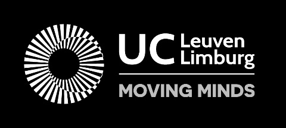
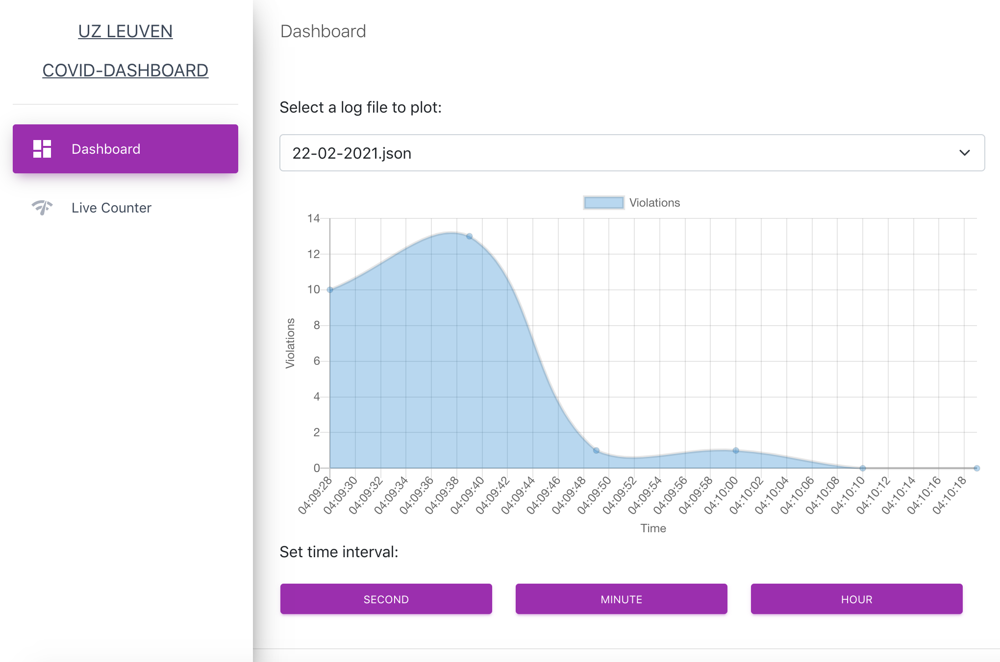
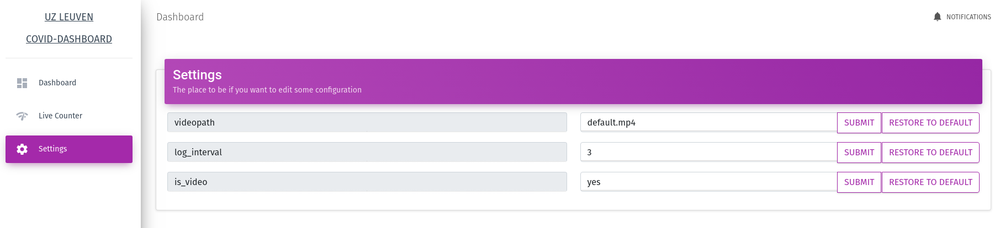

## Donderdag 11 Februari

### Verslag Vergadering 

| DATUM: | AANWEZIGEN:                                                  | **VERONTSCHULDIGD:** | VERSLAGGEVER:    | DATUM VOLGENDE VERGADERING: | AGENDA:                     |
| ------ | ------------------------------------------------------------ | -------------------- | ---------------- | --------------------------- | --------------------------- |
| 11/02  | Johan Strypsteen, Patrick De Mazière, Siegmund Leducq, David Vandenbroeck, Tim Vanherwegen, Robbe De Bie, Martijn Meeldijk, Louis Van de Perre | n/a                  | Martijn Meeldijk | 19/02                       | Feedback en verduidelijking |

**KORT VERSLAG**:

Eerste vergadering met wat feedback. We hebben meer duidelijkheid gekregen over wat er van ons wordt verwacht. We hebben kennis gemaakt met het NVidia Jetson bordje. 

**ACTIES**:

We werken verder om Tensorflow werkende te krijgen op het bordje. Mr. Geens heeft ons in een vorige vergadering ook tips gegeven om de prestaties van de camera te verhogen. Nu moeten we zien welke mogelijkheden er zijn. 

## Vrijdag 19 Februari

### Verslag Vergadering 

| DATUM: | AANWEZIGEN:                                                  | **VERONTSCHULDIGD:** | VERSLAGGEVER:    | DATUM VOLGENDE VERGADERING: | AGENDA:  |
| ------ | ------------------------------------------------------------ | -------------------- | ---------------- | --------------------------- | -------- |
| 19/02  | Johan Strypsteen, Siegmund Leducq, David Vandenbroeck, Tim Vanherwegen, Robbe De Bie, Martijn Meeldijk, Louis Van de Perre | n/a                  | Martijn Meeldijk | 25/02                       | Feedback |

**KORT VERSLAG**: 

We wilden een demo van ons project aan Mr. Strypsteen geven op het jetson bordje, maar vlak voor de vergadering werkte het niet meer. We hebben een demo gegeven op een ander apparaat. Plots heeft Tim ons programma tijdens de meeting weer aan de praat gekregen. Strypsteen gaf ons het idee om de groep in twee te splitsen. Eén deel van de groep zou aan een systeem werken om data en statistieken vast te leggen (Martijn en Robbe). En de rest (Tim en Louis) zou verder werken aan het AI gedeelte. (het detecteren van mensen en de afstanden berekenen)  

**ACTIES**:

Martijn en Robbe werken aan een nieuw gedeelte voor statistieken. 

Tim en Louis proberen het bestaande gedeelte te verbeteren d.m.v. het gebruik van andere modellen en/of het bestaande model bij te trainen.

  

##  Maandag 22 Februari

### Verslag (korte) Vergadering 

| DATUM: | AANWEZIGEN:                                                  | **VERONTSCHULDIGD:** | VERSLAGGEVER:    | DATUM VOLGENDE VERGADERING: | AGENDA:                                   |
| ------ | ------------------------------------------------------------ | -------------------- | ---------------- | --------------------------- | ----------------------------------------- |
| 22/02  | Johan Strypsteen, Siegmund Leducq, Tim Vanherwegen, Robbe De Bie, Martijn Meeldijk, Louis Van de Perre | n/a                  | Martijn Meeldijk | 24/02                       | Korte vergadering om voortgang te checken |

**KORT VERSLAG**: 

Mr. Strypsteen was zeer tevreden met de voorgang die we de voorbije twee werkdagen hebben geboekt. Martijn en Robbe hebben een visueel dashboard gemaakt voor de applicatie (zie screenshot). Deze applicatie kan live statistieken tonen van het aantal overtredingen en de drukte. Als de applicatie draait wordt er automatisch van elke dag een logbestand bijgehouden in een JSON. Deze kunnen, zelfs als het detectiesysteem draait, uitgelezen worden en visueel worden weergegeven op het dashboard. 

Tim en Louis hebben veel opzoekwerk gedaan over welke modellen ons programma beter zouden kunnen draaien. In conclusie is het huidige model waarschijnlijk de beste optie. Ze hebben ook pogingen gedaan om een eigen model te trainen of een bestaand model bij te trainen. Tot nu toe is dit nog work in progress.

**ACTIES**:

Verder werken aan de webapp. Optimalisaties doen om het programma beter te doen werken op de jetson. 

##  Woensdag 24 Februari

### Verslag (korte) Vergadering 

| DATUM: | AANWEZIGEN:                                                  | **VERONTSCHULDIGD:** | VERSLAGGEVER: | DATUM VOLGENDE VERGADERING: | AGENDA:                  |
| ------ | ------------------------------------------------------------ | -------------------- | ------------- | --------------------------- | ------------------------ |
| 24/02  | Johan Strypsteen, Siegmund Leducq, David Vandenbroeck, Tim Vanherwegen, Robbe De Bie, Martijn Meeldijk, Louis Van de Perre | n/a                  | Robbe De Bie  | 01/03                       | Updaten over vooruitgang |

**KORT VERSLAG**: 

Korte vergadering waarin we verdere vooruitgang hebben getoond. Terwijl Tim en Louis onderzoek deden naar het verder trainen van het model, hebben Robbe en Martijn hebben verder aan het dashboard. Ze hebben een Settings pagina toegevoegd, zodat je op de website zelf de config.ini file kunt bijwerken, ipv de files zelf aan te passen.

De lectoren/begeleiders waren over het algemeen zeer tevreden over de vooruitgang die we hebben geboekt. Het is nog een beetje afwachten op de resultaten van het verder trainen van het model, maar over het algemeen is het product zo goed als af.

**ACTIES**:

Final touches aan de webapp doen, trainen van het model.

  

 

 

 